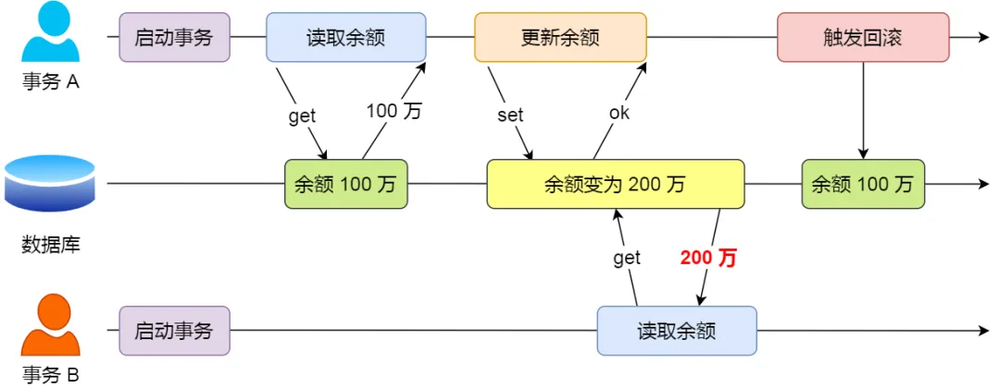
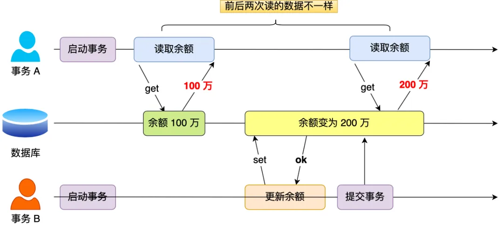
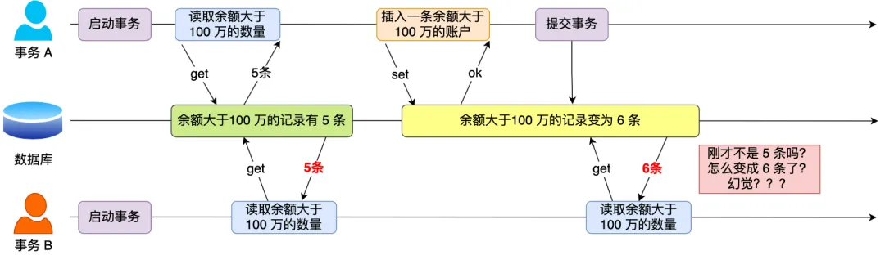
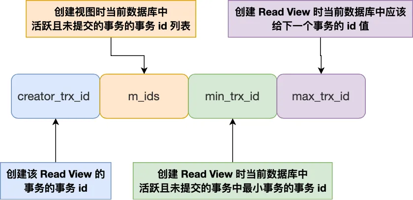

## 事务的特性

1. **原子性**（_Atomicity_）：一个事务中的所有操作，要么全部完成，要么全部不完成，不会结束在中间某个环节，而且事务在执行过程中发生错误，会被回滚到事务开始前的状态，就像这个事务从来没有执行过一样
2. **一致性**（_Consistency_）：数据库的完整性不会因为事务的执行而受到破坏，比如表中有一个字段为姓名，它有唯一约束，也就是表中姓名不能重复，如果一个事务对姓名字段进行了修改，但是在事务提交后，表中的姓名变得非唯一性了，这就破坏了事务的一致性要求，这时数据库就要撤销该事务，返回初始化的状态
3. **隔离性**（_Isolation_）：数据库允许多个并发事务同时对其数据进行读写和修改的能力，隔离性可以防止多个事务并发执行时由于交叉执行而导致数据的不一致
4. **持久性**（_Durability_）：事务处理结束后，对数据的修改就是永久的，即便系统故障也不会丢失

### 如何保证事务的四个特性（InnoDB）

1. 原子性和持久性是通过 **redo log**（重做日志）保证的
2. 一致性是通过 **undo log**（回滚日志）保证的
3. 隔离性是通过 **MVCC**（多版本并发控制）或 **锁机制** 保证的

## 并行事务可能引发的问题

严重性排序：

$$
脏读 > 不可重复读 > 幻读
$$

### 脏读

如果一个事务 **读到** 了另一个 **未提交的事务修改过的数据**，就发生了 **脏读**（_dirty read_）

假设有 A 和 B 这两个事务同时在处理，事务 A 先开始从数据库中读取小林的余额数据，然后再执行更新操作，如果此时事务 A 还没有提交事务，而此时正好事务 B 也从数据库中读取小林的余额数据，那么事务 B 读取到的余额数据是刚才事务 A 更新后的数据，即使没有提交事务

因为事务 A 是还没提交事务的，也就是它随时可能发生回滚操作，如果在上面这种情况事务 A 发生了 **回滚**，那么事务 B 刚才得到的数据就是过期的数据，这种现象就被称为 **脏读**

### 不可重复读

在一个事务内多次读取同一个数据，如果出现前后两次读到的数据不一样的情况，就发生了 **不可重复读**（_non-repeatable read_）

假设有 A 和 B 这两个事务同时在处理，事务 A 先开始从数据库中读取小林的余额数据，然后继续执行代码逻辑处理在这过程中如果事务 B 更新了这条数据，并提交了事务，那么当事务 A 再次读取该数据时，就会发现前后两次读到的数据是不一致的，这种现象就被称为 **不可重复读**

## 幻读

在一个事务内多次查询某个符合查询条件的 **记录数量**，如果出现前后两次查询到的记录数量不一样的情况，就发生了 **幻读**（_phantom read_）

假设有 A 和 B 这两个事务同时在处理，事务 A 先开始从数据库查询账户余额大于 100 万的记录，发现共有 5 条，然后事务 B 也按相同的搜索条件也是查询出了 5 条记录

接下来，事务 A 插入了一条余额超过 100 万的账号，并提交了事务，此时数据库超过 100 万余额的账号个数就变为 6

然后事务 B 再次查询账户余额大于 100 万的记录，此时查询到的记录数量有 6 条，发现和前一次读到的记录数量不一样了，就感觉发生了幻觉一样，这种现象就被称为 **幻读**

## 事务的隔离级别

1. **读未提交**（_read uncommitted_）：指一个事务还没提交时，它做的变更就能被其他事务看到
2. **读已提交**（_read committed_）：指一个事务提交后，它做的变更才能被其他事务看到
3. **可重复读**（_repeatable read_）：指一个事务执行过程中看到的数据，一直跟这个事务启动时看到的数据是一致的，MySQL InnoDB 引擎的 **默认隔离级别**
4. **串行化**（_serializable_）：会对记录加上读写锁，在多个事务对这条记录进行读写操作时，如果发生了读写冲突的时候，后访问的事务必须等前一个事务执行完成，才能继续执行

按隔离水平高低排序：

$$
串行化 > 可重复读 > 读已提交 > 读未提交
$$

针对不同的隔离级别，并发事务可能发生的现象也会不同：

1. **读未提交**，可能发生 **脏读**、**不可重复读** 和 **幻读** 现象
2. **读已提交**，可能发生 **不可重复读** 和 **幻读** 现象
3. **可重复读**，可能发生 **幻读** 现象
4. **串行化**，不可能发生三个现象

但是，不建议通过使用 **串行化** 的方式解决 **幻读** 现象，这样会导致数据库在并发事务时的性能很差

InnoDB 引擎的默认隔离级别虽然是 **可重复读**，但是通过 **next-key lock 锁**（行锁和间隙锁的组合）来锁住记录之间的间隙和记录本身，防止其他事务在这个记录之间插入新的记录，这样就避免了幻读现象

## 可重复读隔离级别如何实现

**可重复读** 隔离级别是启动事务时生成一个 Read VIew，然后整个事务期间都用这个 Read View

1. **m_ids**：指的是创建 Read View 时当前数据库中活跃且未提交的事务的事务 id **列表**
2. **min_trx_id**：指的是创建 Read View 时当前数据库中活跃且未提交的事务中最小的事务 id，也就是 m_ids 的最小值
3. **max_trx_id**：这个并不是 m_ids 的最大值，而是创建 Read View 时当前数据库中应该给下一个事务的 id 值
4. **creator_trx_id**：指的是创建该 Read View 的事务的事务 id

对于使用 InnoDB 存储引擎的数据库表，它的聚簇索引记录中都会包含两个隐藏列：

1. **trx_id**，当一个事务对某条聚簇索引记录进行改动时，就会把该事务的事务 id 记录在 trx_id 隐藏列中
2. **roll_pointer**，每次对某条聚簇索引记录进行改动时，都会把旧版本的记录写入到 undo log 中，这个隐藏列是个指针，指向旧版本记录

可重复读隔离级别就是在启动时创建了 Read View，然后在事务期间读取数据的时候，在找到数据后，先会将该记录的 trx_id 和该事务的 Read View 里的字段做个比较：

1. 如果记录的 trx_id 比该事务的 Read View 中的 creator_trx_id 要小，且不在 m_ids 列表里，这意味着这条记录的事务早就在该事务前提交过了，所以该记录对该事务可见
2. 如果记录的 trx_id 比该事务的 Read View 中的 creator_trx_id 要大，且在 m_ids 列表里，这意味着该事务读到的是和自己同时启动的另外一个事务修改的数据，这时就不应该读取这条记录，而是沿着 undo log 链条往下找旧版本的记录，直到找到 trx_id 等于或者小于该事务 id 的第一条记录

这种通过记录的版本链来控制并发事务访问同一个记录时的行为，就叫 MVCC（多版本并发控制）

## 读已提交隔离级别如何实现

读提交隔离级别是在每个 select 都会生成一个新的 Read View，也意味着，事务期间的多次读取同一条数据，前后两次读的数据可能会出现不一致，因为可能这期间另外一个事务修改了该记录，并提交了事务
