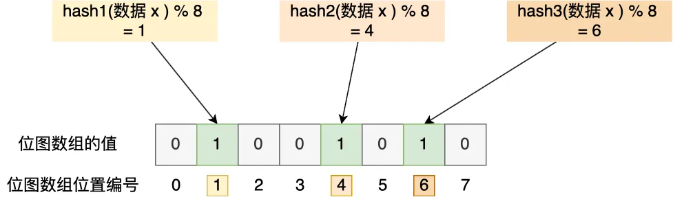

## 组成

布隆过滤器由 **初始值都为 0 的位图数组** 和 **N 个哈希函数** 两部分组成。

## 完成标记的步骤

1. 使用 N 个哈希函数分别对数据进行哈希计算，得到 N 个哈希值
2. 将第一步得到的 N 个哈希值对位图数组的长度取模，得到每个哈希值在位图数组中的对应位置
3. 将每个哈希值在位图数组的对应位置的值设为 1

举个例子，假设有个位图长度为 8，哈希函数 3 个的布隆过滤器

## 假阳性

布隆过滤器是基于哈希函数实现查找的，高效查找的同时存在 **哈希冲突** 的可能性，比如数据 x 和数据 y 都可能落在第 1、4、6 位置，但事实上数据库中并不存在数据 y，存在误判的情况

## 总结

查询布隆过滤器时，返回数据存在，并不一定证明数据库中存在该数据，但是返回不存在，数据库中一定不存在该数据。