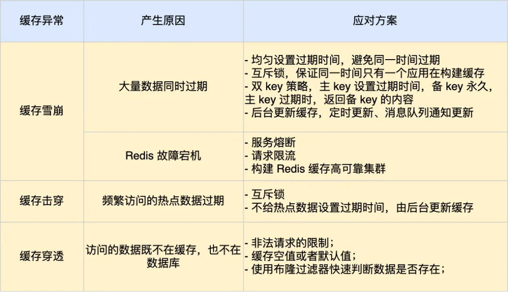

## 缓存雪崩

### 原因

1. 大量缓存数据同时过期
2. redis 故障

### 应对策略
1. 大量数据同时过期
	1. **均匀设置过期时间** ：给缓存数据的过期时间加上一个随机数
	2. **互斥锁** ：当业务线程在处理用户请求时，**如果发现访问的数据不在 redis 中，就加个互斥锁，保证同一时间内只有一个请求构建缓存**，当缓存构建完成后，再释放锁。未能获取互斥锁的请求，要么等待锁释放后重新读取缓存，要么就返回空值或默认值。（互斥锁最好设置**超时时间**）
	3. **双 key 策略** ：使用两个 key 缓存数据，一个是**主 key**，会设置**过期时间**；一个是**备 key**，不会设置过期时间。当业务线程访问不到**主 key** 的缓存数据时，就返回**备 key** 的数据，更新缓存时，同时更新主备 key 的数据
	4. **后台更新缓存** ：业务线程不再负责更新缓存，缓存也不设置有效期，而是让缓存永久有效，并让更新缓存的工作交由后台线程定时更新。后台更新缓存的机制适合做**缓存预热**，当缓存数据被淘汰时，有两种方式解决：
		1. 后台线程不仅负责定时更新缓存，而且也负责**频繁地检测缓存是否有效**，检测到缓存失效了，便从数据库读取并更新。检测间隔应为**毫秒级**
		2. 业务线程发现缓存数据失效后，通过**消息队列**通知后台线程更新缓存。
2. redis 故障宕机
	1. **服务熔断或请求限流机制** 
		1. 启用**服务熔断**机制，暂停业务应用对缓存服务的访问，直接返回错误。
		2. 启用**请求限流**机制，只允许少量请求发送到数据库，再多的请求直接在入口拒绝服务。
	2. **构建 redis 缓存高可靠集群** ：主从节点

## 缓存击穿

### 原因

1. 热点数据缓存过期

### 应对策略

1. **互斥锁** ：保证同一时间内只有一个业务线程更新缓存，未能获取互斥锁的请求，要么等待锁释放后重新读取内存，要么就返回空值或默认值。
2. **永久有效** ：不给热点数据设置过期时间，由后台异步更新缓存，或者在热点数据准备过期前，提前通知后台线程更新缓存以及重新设置过期时间。

## 缓存穿透

### 原因

1. 数据既不在缓存，也不在数据库

### 应对策略

1. **限制非法请求** ：在 api 入口处判断请求参数是否合理、是否含有非法值、请求字段是否存在，如果判断出是恶意请求就直接返回错误，避免进一步访问缓存或数据库。
2. **缓存空值或默认值** ：在缓存中设置一个空值或默认值，发生缓存穿透时就可以直接返回空值或默认值，而不会继续查询数据库。
3. **[[布隆过滤器]]** ：使用[[布隆过滤器]]快速判断数据是否存在，避免通过查询数据库判断。

## 总结

