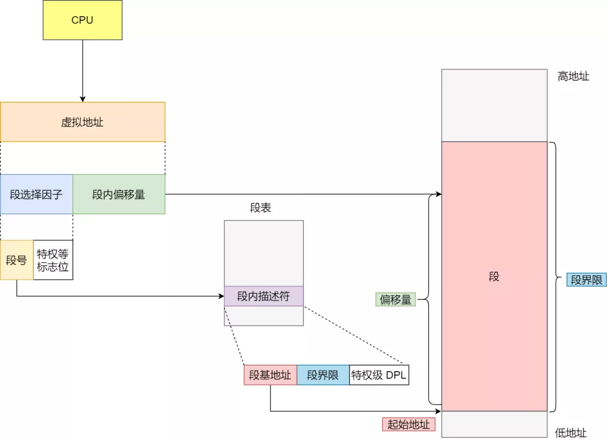

## 虚拟内存

单片机的 CPU 直接操作内存的 **物理地址**，这种情况无法在内存中同时运行两个程序

操作系统通过把进程所使用的地址 **隔离** 开来，为每个进程分配独立的一套 **虚拟地址**，互不干涉

操作系统会提供一种机制，将不同进程的虚拟地址和不同内存的物理地址映射起来

如果程序要访问虚拟地址的时候，由操作系统转换为不同的物理地址，这样不同的进程运行的时候，写入的是不同的物理地址，就不会冲突了

1. 程序所使用的内存地址叫做 **虚拟内存地址**（Virtual Memory Address）
2. 实际存在硬件里面的空间地址叫做 **物理内存地址**（Physical Memory Address）

操作系统引入了虚拟内存，进程持有的虚拟地址会通过 CPU 中的 **内存管理单元**（MMU）的映射关系，转换为物理地址，再通过物理地址访问内存

### 操作系统如何管理虚拟地址和物理地址之间的关系

#### 内存分段

程序是由若干个逻辑分段组成的，如可由代码分段、数据分段、栈段、堆段组成。不同的段有不同的属性，所以就用 **分段**（Segmentation）的形式把这些段分离出来

##### 分段机制下，虚拟内存和物理地址是如何映射的

分段机制下的虚拟地址由两部分组成，**段选择子** 和 **段内偏移量**

1. 段选择子就保存在段寄存器中。段选择子里最重要的是 **段号**，用作段表的索引。段表里面保存的是 **段的基地址**、**段的界限** 和 **特权等级** 等
2. 虚拟地址中的段内偏移量应该位于 0 和段界限之间，如果段内偏移量是合法的，就将段基地址加上段内偏移量得到物理内存地址

##### 不足之处

1. 内存碎片
2. 内存交换效率低

##### 内存碎片

假设有 1 G 的物理内存，用户执行了多个程序，其中：

1. 游戏占用了 512 MB 内存
2. 浏览器占用了 128 MB 内存
3. 音乐占用了 256 MB 内存

此时如果关闭了浏览器，则空闲内存还有 1024 - 512 - 256 = 256 MB

如果这 256 MB 不是连续的，而是被分为两段 128 MB 的内存，就会导致没有空间再打开一个 200 MB的程序

这里的内存碎片的问题共有两处地方：

1. 外部内存碎片，也就是产生了多个不连续的小物理内存，导致新的程序无法被装载
2. 内部内存碎片，程序所有的内存都被装载到了物理内存，但是这个程序有部分内存可能不是很常使用，也会造成内存的浪费

解决外部内存碎片问题的就是 **内存交换**

可以把音乐程序占用的 256 MB 内存写回硬盘，再从硬盘读回内存，不过再读回的时候不是装载回原来的位置，而是尽可能空缺出连续的空间

这个内存交换空间，在 Linux 系统里，也就是 Swap 空间，这块空间是从硬盘划分出来的，用于内存与硬盘的空间交换

##### 内存交换效率低

对于多进程的系统来说，用分段的方式，内存碎片是很容易产生的，产生了内存碎片，就需要重新 Swap 内存区域，这个过程会产生性能瓶颈

所以，如果内存交换的时候，交换的是一个占内存空间很大的程序，整个机器都会显得卡顿

#### 内存分页

分段的好处是能产生连续的内存空间，但是会出现内存碎片和内存交换的空间太大的问题

**内存分页**（Paging）是把整个虚拟内存和物理内存空间切成一段段固定尺寸的大小。这样一个连续并且尺寸固定的内存空间叫做 **页**（Page）。在 Linux 中，每一页的大小是 **4 KB**

虚拟地址与物理地址之间通过 **页表** 来映射，页表实际存储在 CPU 的 **内存管理单元**（MMU）中。当进程访问的虚拟地址在页表中查不到时，系统会产生一个 **缺页异常**，进入系统内核空间分配物理内存、更新进程页表，最后再返回用户空间，恢复进程的运行

##### 分页是怎么解决分段的内存碎片、内存交换效率低的问题

采用了分页，释放的内存都是以页为单位释放的，不会产生无法给进程使用的小内存

如果内存空间不够，操作系统会把其他正在运行的进程中的 **最近最少使用** 的内存页面释放掉，暂时写在硬盘上，称为 **换出**（Swap Out）。一旦需要的时候，再加载进来，称为 **换入**（Swap In）。所以，一次性写入磁盘的只有少数的一个或几个页，不会花太多时间，内存交换的效率相对较高

同时，分页的方式可以做到只有在程序运行中，需要用到对应虚拟内粗里面的指令和数据时，再加载到物理内存中

##### 分页机制下，虚拟地址和物理地址如何映射

在分页机制下，虚拟地址分为两部分，**页号** 和 **页内偏移**，页号作为页表的索引，页表包含物理页每页所在物理内存的基地址，这个基地址与页内偏移的组合就形成了物理内存地址

##### 简单的分页有什么缺陷

空间上的缺陷。在 32 位系统下，虚拟地址空间共有 4 GB，假设一个页的大小是 4 KB（2^12），那么就需要大约 100 万（2^20）个页，每个页表项需要 4 Byte 存储，那么整个 4 GB 空间的映射就需要 4 MB 的内存来存储页表。但是这只是单一进程的，如果有 100 个进程，就需要 400 MB 的内存存储页表

##### 多级页表（Multi-Level Page Table）

把这个 100 万个页表项的单级页表再分页，将一级页表分为 1024 个二级页表，每个二级页表中包含 1024 个页表项，形成 **二级分页**，如下图所示：

每个进程都有 4 GB 的虚拟地址空间，显然对于大多数程序来说，其使用到的空间远未达到 4 GB，因为会存在部分对应的页表项都是空的，根本没有分配，对于已分配的页表项，如果存在最近一段时间未访问的页表，在物理内存紧张的情况下，操作系统会将页面换出到硬盘，也就是说不会占用物理内存

如果使用了二级分页，一级页表就可以覆盖整个 4 GB 虚拟地址空间，但如果某个一级页表的页表项没有被用到，也就不需要创建这个页表项对应的二级页表了，即可以在需要时才创建二级页表

页表一定要覆盖全部虚拟地址空间，不分级的页表需要 100 多万个页表项来映射，而二级页表只需要 1024 个页表项

对于 64 位的系统，两级分页肯定不够了，就变成了四级目录，分别是：

1. 全局页目录项 PGD（Page Global Directory）
2. 上层页目录项 PUD（Page Upper Directory）
3. 中间页目录项 PMD（Page Middle Directory）
4. 页表项 PTE（Page Table Entry）

##### TLB

利用程序的局部性特性，把最常访问的几个页表项存储到访问速度更快的硬件，于是就在 CPU 中加入了专门存放程序最常访问的页表项的 Cache —— TLB（Translation Lookaside Buffer），通常称为页表缓存、转址旁路缓存、快表等

#### 段页式内存管理

段页式内存管理实现的方式：

1. 先将程序划分为多个有逻辑意义的段，也就是 [分段机制](#内存分段)
2. 再把每个段划分为多个页，也就是对分段划分出来的连续空间，再划分为固定大小的页

这样，地址结构就由 **段号**、**段内页号** 和 **页内位移** 三部分组成

段页式地址变换中要得到物理地址须经过三次内存访问：

1. 第一次访问段表，得到页表起始地址
2. 第二次访问页表，得到物理页号
3. 第三次将物理页号与页内位移组合，得到物理地址

## Linux 内存管理

Linux 内存主要采用的是页式内存管理，但同时也不可避免地涉及了段机制

Linux 系统中的每个段都是从 0 地址开始的整个 4 GB 虚拟空间（32 位环境下），也就是所有的段的起始地址都是一样的。这意味着，Linux 系统中的代码，包括操作系统本身的代码和应用程序代码，所面对的地址空间都是线性地址空间（虚拟地址），相当于屏蔽了处理器中的逻辑地址概念，段只被用于访问控制和内存保护

### Linux 的虚拟地址空间是如何分布的

在 Linux 系统中，虚拟地址空间的内部又被分为 **内核空间** 和 **用户空间** 两部分，不同位数的系统，地址空间的范围也不同

#### 内核空间和用户空间的区别

1. 进程在用户态时，只能访问用户空间内存
2. 只有进入内核态后，才可以访问内核空间的内存

虽然每个进程都有各自独立的虚拟内存，但是每个虚拟内存中的内核地址，其实关联的都是相同的物理内存