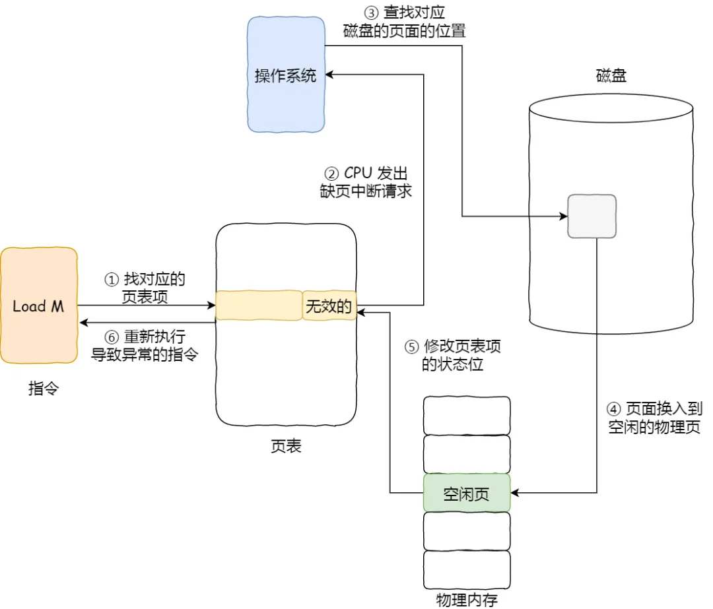

## 缺页中断

当 CPU 访问的页面不在物理内存时，便会产生一个缺页中断，请求操作系统将所缺页调入到物理内存。那它与一般中断的主要区别在于：

1. 缺页中断在指令执行 **期间** 产生和处理中断信号，而一般中断在一条指令执行 **完成** 后检查和处理中断信号
2. 缺页中断返回到该指令的开始重新执行 **该指令**，而一般中断返回回到该指令的 **下一个指令** 执行

缺页中断的处理流程：

1. 在 CPU 里访问一条 Load M 指令，然后 CPU 会去找 M 所对应的页表项
2. 如果该页表项的状态位是 **有效的**，那 CPU 就可以直接去访问物理内存了，如果状态位是 **无效的**，则 CPU 则会发送缺页中断请求
3. 操作系统收到了缺页中断，则会执行缺页中断处理函数，先会查找该页面在磁盘中的页面的位置
4. 找到磁盘中对应的页面后，需要把该页面换入到物理内存中，但是在换入前，需要在物理内存中找空闲页，如果找到空闲页，就把页面换入到物理内存中
5. 页面从磁盘换入到物理内存完成后，则把页表项中的状态位修改为 **有效的**
6. 最后，CPU 重新执行导致缺页异常的指令

上面所说的过程，第 4 步是能在物理内存找到空闲页的情况，那如果找不到呢？

找不到空闲页的话，就说明此时内存已满了，这时候，就需要 **页面置换算法** 选择一个物理页，如果该物理页有被修改过（脏页），则把它换出到磁盘，然后把该被置换出去的页表项的状态改成 **无效的**，最后把正在访问的页面装入到这个物理页中

页表项通常有如下图的字段：

1. **状态位**：用于表示该页是否有效，也就是说是否在物理内存中，供程序访问时参考
2. **访问字段**：用于记录该页在一段时间被访问的次数，供页面置换算法选择出页面时参考
3. **修改位**：表示该页在调入内存后是否有被修改过，由于内存中的每一页都在磁盘上保留一份副本，因此，如果没有修改，在置换该页时就不需要将该页写回到磁盘上，以减少系统的开销；如果已经被修改，则将该页重写到磁盘上，以保证磁盘中所保留的始终是最新的副本
4. **硬盘地址**：用于指出该页在硬盘上的地址，通常是物理块号，供调入该页时使用

所以，页面置换算法的功能是，**当出现缺页异常，需调入新页面而内存已满时，选择被置换的物理页面**，也就是说选择一个物理页面换出到磁盘，然后把需要访问的页面换入到物理页

常见的页面置换算法有如下几种：

1. **[最佳页面置换算法](#最佳页面置换算法)**（OPT）
2. **[先进先出置换算法](#先进先出置换算法)**（FIFO）
3. **[最近最久未使用置换算法](#最近最久未使用置换算法)**（LRU）
4. **[时钟页面置换算法](#时钟页面置换算法)**（Clock）
5. **[最不常用置换算法](#最不常用置换算法)**（LFU）

## 最佳页面置换算法

最佳页面置换算法基本思路是，**置换在未来最长时间不访问的页面**

所以，该算法实现需要计算内存中每个逻辑页面的下一次访问时间，然后比较，选择未来最长时间不访问的页面。但是实际系统中无法实现，因为程序访问页面时是动态的，我们是无法预知每个页面在下一次访问前的等待时间

所以，最佳页面置换算法作用是为了衡量你的算法的效率，你的算法效率越接近该算法的效率，那么说明你的算法是高效的

## 先进先出置换算法

可以 **选择在内存驻留时间很长的页面进行中置换**，这个就是先进先出置换算法的思想

## 最近最久未使用算法

基本思路是，发生缺页时，**选择最长时间没有被访问的页面进行置换**，也就是说，该算法假设已经很久没有使用的页面很有可能在未来较长的一段时间内仍然不会被使用

虽然 LRU 在理论上是可以实现的，但代价很高。为了完全实现 LRU，需要在内存中维护一个所有页面的链表，最近最多使用的页面在表头，最近最少使用的页面在表尾

困难的是，在每次访问内存时都必须要更新 **整个链表**。在链表中找到一个页面，删除它，然后把它移动到表头是一个非常费时的操作

## 时钟页面置换算法

跟 LRU 近似，又是对 FIFO 的一种改进。该算法的思路是，把所有的页面都保存在一个类似钟面的「环形链表」中，一个表针指向最老的页面

当发生缺页中断时，算法首先检查表针指向的页面：

1. 如果它的访问位是 0 就淘汰该页面，并把新的页面插入这个位置，然后把表针前移一个位置
2. 如果访问位是 1 就清除访问位，并把表针前移一个位置，重复这个过程直到找到了一个访问位为 0 的页面为止

## 最不常用置换算法

**当发生缺页中断时，选择访问次数最少的那个页面，并将其淘汰**

它的实现方式是，对每个页面设置一个访问计数器，每当一个页面被访问时，该页面的访问计数器就累加 1。在发生缺页中断时，淘汰计数器值最小的那个页面

但是，LFU 算法只考虑了频率问题，没考虑时间的问题，比如有些页面在过去时间里访问的频率很高，但是现在已经没有访问了，而当前频繁访问的页面由于没有这些页面访问的次数高，在发生缺页中断时，就会可能会误伤当前刚开始频繁访问，但访问次数还不高的页面
