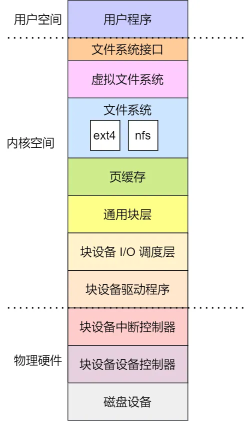

可以把 Linux 存储系统的 I/O 由上到下可以分为三个层次，分别是 [文件系统层](文件系统)、[通用块层](通用块层)、设备层。他们整个的层次关系如下图

这三个层次的作用是：

1. 文件系统层，包括虚拟文件系统和其他文件系统的具体实现，它向上为应用程序统一提供了标准的文件访问接口，向下会通过通用块层来存储和管理磁盘数据
2. 通用块层，包括块设备的 I/O 队列和 I/O 调度器，它会对文件系统的 I/O 请求进行排队，再通过 I/O 调度器，选择一个 I/O 发给下一层的设备层
3. 设备层，包括硬件设备、[设备控制器](设备控制器) 和 [驱动程序](设备驱动程序)，负责最终物理设备的 I/O 操作

有了文件系统接口之后，不但可以通过文件系统的命令行操作设备，也可以通过应用程序，调用 `read`、`write` 函数，就像读写文件一样操作设备，所以说设备在 Linux 下，也只是一个特殊的文件

但是，除了读写操作，还需要有检查特定于设备的功能和属性。于是，需要 `ioctl` 接口，它表示输入输出控制接口，是用于配置和修改特定设备属性的通用接口

另外，存储系统的 I/O 是整个系统最慢的一个环节，所以 Linux 提供了不少缓存机制来提高 I/O 的效率

1. 为了提高文件访问的效率，会使用 **页缓存、索引节点缓存、目录项缓存** 等多种缓存机制，目的是为了减少对块设备的直接调用
2. 为了提高块设备的访问效率， 会使用 **缓冲区**，来缓存块设备的数据
