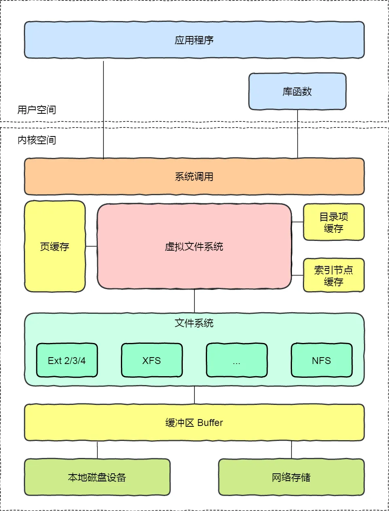
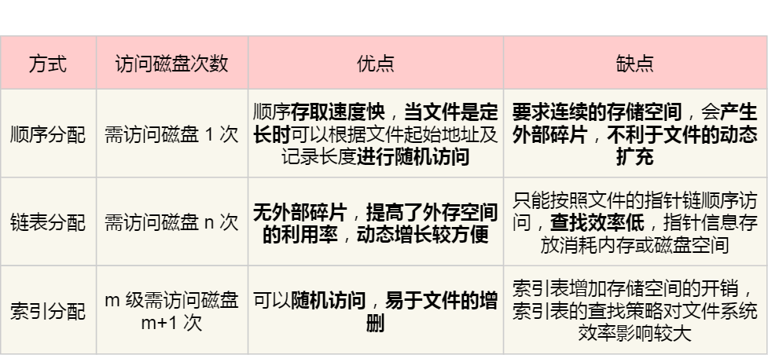
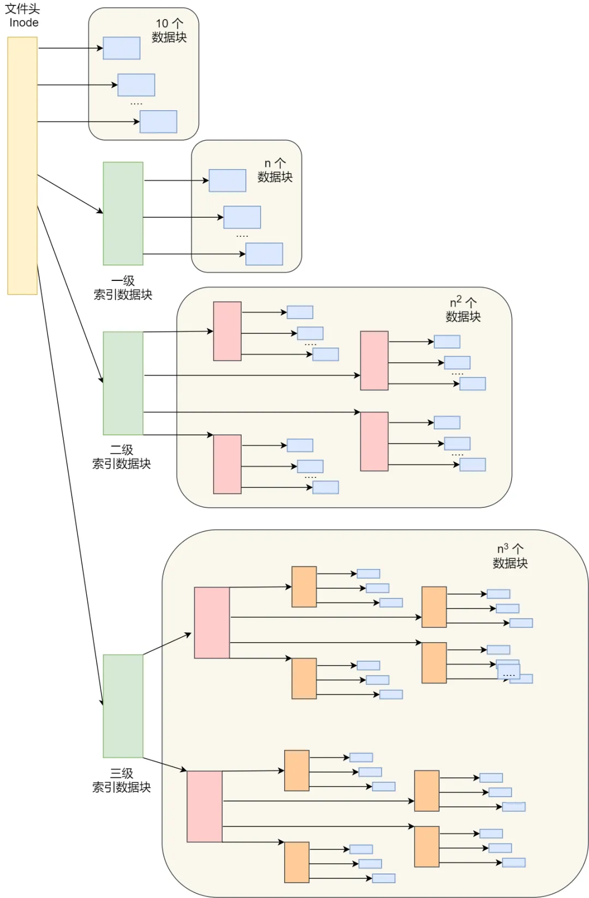
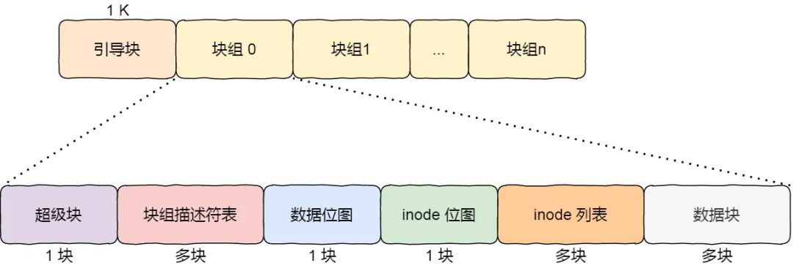

## 文件系统的基本组成

文件系统是操作系统中负责 **管理持久数据** 的子系统，文件系统的基本数据单位是文件，它的目的是对磁盘上的文件进行组织管理，组织的方式不同，就会形成不同的文件系统

Linux 文件系统会为每个文件分配两个数据结构：**索引节点**（index node）和 **目录项**（directory entry），用于记录文件的元信息和目录层次结构

1. 索引节点，也就是 inode，用于记录文件的元信息，比如 inode 编号、文件大小、访问权限、创建时间、修改时间、数据在磁盘的位置等等。索引节点是文件的 **唯一** 标识，它们一一对应，也都会存储在磁盘，所以索引节点同样占用着磁盘空间
2. 目录下，也就是 dentry，用于记录文件的名字、索引节点指针以及与其他目录项的层级关联关系。多个目录项关联起来，就会形成目录结构，但它与索引节点不同的是，目录项是由内核维护的一个数据结构，不存放于磁盘，而是缓存在内存

由于索引节点唯一标识一个文件，而目录项记录着文件的名字，所以目录项和索引节点的关系是多对一，也就是说，一个文件可以有多个别名。比如，硬链接的实现就是多个目录项中的索引节点指向同一个文件

注意，目录也是文件，也是用索引节点唯一标识，和普通文件不同的是，普通文件在磁盘里面保存的是文件数据，而目录文件保存的是子目录或文件

### 文件数据如何存储在磁盘

磁盘读写的最小单位是 **扇区**，扇区的大小只有 **512 B**，文件系统将多个扇区组成了一个逻辑块，每次读写的最小单位就是逻辑块，Linux 中逻辑块的大小为 **4 KB**，也就是一次性读写 8 个扇区

磁盘进行格式化的时候，会被分为三个存储区域，分别是超级块、索引节点区和数据块区

1. **超级块**：用来存储文件系统的详细信息，比如块大小、块个数、空闲块等等。当文件系统挂载时进入内存
2. **索引节点区**：用来存储索引节点。当文件被访问时进入内存
3. **数据块区**：用来存储文件或目录数据

## 虚拟文件系统

文件系统的种类众多，而操作系统希望对用户提供一个统一的接口，于是在用户层与文件系统层引入了中间层，这个中间层就是 **虚拟文件系统**（Virtual File System，VFS）。

### 按存储位置的不同分为三类文件系统

1. **磁盘的文件系统**：直接把数据存储在磁盘中，比如 Ext 2/3/4、XFS 等都是这类文件系统
2. **内存的文件系统**：把数据存在内存空间，比如 \/proc 和 \/sys 文件系统
3. **网络的文件系统**：用于访问其他计算机主机数据的文件系统，比如 NFS、SMB 等等

## 文件的存储

文件的数据存放的方式有以下两种：

1. [连续空间存放方式](#连续空间存放方式)
2. [非连续空间存放方式](#非连续空间存放方式)
	1. [链表存放方式](#链表存放方式)
	2. [索引存放方式](#索引存放方式)

### 连续空间存放方式

文件存放在磁盘连续的物理空间，读写效率很高，但前提是必须先知道一个文件的大小。所以，文件头里需要指定 **起始块的位置** 和 **长度**

连续空间存放的方式虽然读写效率高，但是有 **磁盘空间碎片** 和 **文件长度不易扩展** 的缺陷

### 非连续空间存放方式

#### 链表存放方式

链表的方式存放是 **离散** 的，不用连续的，于是就可以消除磁盘碎片，可大大提高磁盘空间的利用率，同时文件的长度可以动态扩展。根据实现方式的不同，链表可以分为 [隐式链表](#隐式链表) 和 [显式链表](#显式链表) 两种形式

##### 隐式链表

文件头要包含 **第一块** 和 **最后一块** 的位置，并且每个数据块里面留出一个指针空间，用于存放下一个数据块的位置

隐式链表的缺点在于无法直接访问数据块，只能通过指针顺序访问文件，以及数据块指针消耗了一定的存储空间。隐式链表分配的稳定性较差，系统在运行过程中由于软件或者硬件错误导致链表中的指针丢失或损坏，会导致文件数据的丢失

##### 显式链表

如果取出每个磁盘块的指针，放在内存的一个表中，就可以解决隐式链表的两个不足，这个就是 **显式链表**，把用于链接文件各数据块的指针，显式地存放在内存的一张链接表中，该表在整个磁盘仅设置一张，内存中这样一个表格称为 **文件分配表**（File Allocation Table，FAT）

由于查找记录的过程在内存中进行，显著地提高了检索速度，而且大大减少了访问磁盘的次数，但是缺点是不适用于大磁盘

#### 索引存放方式

索引的实现是为每个文件创建一个 **索引数据块**，里面存放的是指向文件数据块的指针列表。另外，文件头需要包含指向 **索引数据块** 的指针

##### 优点

1. 文件的创建、增大、缩小很方便
2. 不会有碎片的问题
3. 支持顺序读写和随机读写

由于索引数据也是存放在磁盘块的，如果文件很小，明明只需一块就可以存放的下，但还是需要额外分配一块来存放索引数据，所以缺陷之一就是存储索引带来的开销

如果文件很大，大到一个索引数据块放不下索引信息，这时又要如何处理大文件的存放呢？可以通过组合的方式，来处理大文件的存储

##### 链式索引块

在索引数据块留出一个存放下一个索引数据块的指针

##### 多级索引块

通过一个索引块来存放多个索引数据块

## Unix 文件的实现方式

根据文件的大小，存放的方式会有所变化：

1. 如果存放文件所需的数据块小于 10 块，则采用 **直接查找** 的方式
2. 如果存放文件所需的数据块超过 10 块，则采用 **一级间接索引** 的方式
3. 如果前面两种方式都不够存放大文件，则采用 **二级间接索引** 的方式
4. 如果二级间接索引也不够存放大文件，则采用 **三级间接索引** 的方式

那么，文件头（Inode）就需要包含 13 个指针：

1. 10 个指向数据块的指针
2. 第 11 个指向索引块的指针
3. 第 12 个指向二级索引块的指针
4. 第 13 个指向三级索引块的指针

所以，这种方式能很灵活地支持小文件和大文件的存放：

1. 对于小文件使用直接查找的方式可减少索引数据块的开销
2. 对于大文件则以多级索引的方式来支持，所以大文件在访问数据块时需要大量查询

## 空闲空间管理

### 空闲表法

空闲表法就是为所有空闲空间建立一张表，表内容包括空闲区的第一个块号和该空闲区的块个数，注意，这个方式是连续分配的

当请求分配磁盘空间时，系统依次扫描空闲表里的内容，直到找到一个合适的空闲区域为止。当用户撤销一个文件时，系统回收文件空间。这时，也需顺序扫描空闲表，寻找一个空闲表条目并将释放空间的第一个物理块号及它占用的块数填到这个条目中

这种方法仅当有少量的空闲区时才有较好的效果。因为，如果存储空间中有着大量的小的空闲区，则空闲表变得很大，这样查询效率会很低。另外，这种分配技术适用于建立连续文件

### 空闲链表法

可以使用链表的方式来管理空闲空间，每一个空闲块里有一个指针指向下一个空闲块

当创建文件需要一块或几块时，就从链头上依次取下一块或几块。反之，当回收空间时，把这些空闲块依次接到链头上

这种技术只要在主存中保存一个指针，令它指向第一个空闲块。其特点是简单，但不能随机访问，工作效率低，因为每当在链上增加或移动空闲块时需要做很多 I/O 操作，同时数据块的指针消耗了一定的存储空间

### 位图法

位图是利用二进制的一位来表示磁盘中一个盘块的使用情况，磁盘上所有的盘块都有一个二进制位与之对应，当值为 0 时，表示对应的盘块空闲，值为 1 时，表示对应的盘块已分配

## 文件系统的结构

在 Linux 文件系统，把 **一个位图的块 + 一系列的块** 这个结构称为一个 **块组**，那么有 N 多的块组，就能够表示 N 大的文件

最前面的第一个块是引导块，在系统启动时用于启用引导，接着后面就是一个一个连续的块组了，块组的内容如下：

1. **超级块**：包含的是文件系统的重要信息，比如 inode 总个数、块总个数、每个块组的 inode 个数、每个块组的块个数等等
2. **块组描述符**：包含文件系统中各个块组的状态，比如块组中空闲块和 inode 的数目等，每个块组都包含了文件系统中 **所有块组的组描述符信息**
3. **数据位图和 inode 位图**：用于表示对应的数据块或 inode 是空闲的，还是被使用中
4. **inode 列表**：包含了块组中所有的 inode，inode 用于保存文件系统中与各个文件和目录相关的所有元数据
5. **数据块**：包含文件的有效数据

可以发现每个块组里有很多重复的信息，比如 **超级块** 和 **块组描述符表**，这两个都是全局信息，而且非常的重要，这么做是有两个原因：

1. 如果系统崩溃破坏了超级块或块组描述符，有关文件系统结构和内容的所有信息都会丢失。如果有冗余的副本，该信息是可能恢复的
2. 通过使文件和管理数据尽可能接近，减少了磁头寻道和旋转，这可以提高文件系统的性能

不过，Ext2 的后续版本采用了稀疏技术。该做法是，超级块和块组描述符表不再存储到文件系统的每个块组中，而是只写入到块组 0、块组 1 和其他 ID 可以表示为 3、 5、7 的幂的块组中

## 目录的存储

和普通文件不同的是，普通文件的块里面保存的是文件数据，而目录文件的块里面保存的是目录里面一项一项的文件信息

在目录文件的块中，最简单的保存格式就是 **列表**，就是一项一项地将目录下的文件信息（如文件名、文件 inode、文件类型等）列在表里。列表中每一项就代表该目录下的文件的文件名和对应的 inode，通过这个 inode，就可以找到真正的文件

如果一个目录有超级多的文件，要想在这个目录下找文件，按照列表一项一项的找，效率就不高了。于是，保存目录的格式改成 **哈希表**，对文件名进行哈希计算，把哈希值保存起来，如果要查找一个目录下面的文件名，可以通过名称取哈希。如果哈希能够匹配上，就说明这个文件的信息在相应的块里面。

Linux 系统的 ext 文件系统就是采用了哈希表，来保存目录的内容，这种方法的优点是查找非常迅速，插入和删除也较简单，不过需要一些预备措施来避免哈希冲突。

目录查询是通过在磁盘上反复搜索完成，需要不断地进行 I/O 操作，开销较大。所以，为了减少 I/O 操作，把当前使用的文件目录缓存在内存，以后要使用该文件时只要在内存中操作，从而降低了磁盘操作次数，提高了文件系统的访问速度。

## 软链接和硬链接

### 硬链接

硬链接是指多个目录项中的索引节点指向一个文件，也就是指向同一个 inode，但是 inode 是不可能跨越文件系统的，每个文件系统都有各自的 inode 数据结构和列表，所以 **硬链接不可用于跨文件系统**。由于多个目录项都是指向同一个 inode，那么只有删除文件的所有硬链接以及源文件时，系统才会彻底删除该文件

### 软链接

软链接相当于重新创建一个文件，这个文件有 **独立** 的 inode，但是这个文件的内容是另外一个文件的路径，所以访问软链接的时候，实际上相当于访问到了另外一个文件，所以 **软链接可用于跨文件系统**，甚至目标文件被删除了，链接文件还存在，只不过指向的文件无法找到了而已

## 文件 I/O

文件读写方式的分类：

1. 缓冲与非缓冲 I/O
2. 直接与非直接 I/O
3. 阻塞与非阻塞 I/O VS 同步与异步 I/O

### 缓冲与非缓冲 I/O

文件操作的标准库可以实现数据的缓存，根据 **是否利用标准库缓冲**，可以把文件 I/O 分为 **缓冲 I/O** 和 **非缓冲 I/O**

1. **缓冲 I/O**：利用标准库的缓存实现文件的加速访问，而标准库再通过系统调用访问文件
2. **非缓冲 I/O**：直接通过系统调用访问文件，不经过标准库缓存

### 直接与非直接 I/O

Linux 内核为了减少磁盘 I/O 次数，在系统调用后，会把用户数据拷贝到内核中缓存起来，这个内核缓存空间也就是 **页缓存**，只有当缓存满足某些条件的时候，才会发起磁盘 I/O 的请求

根据 **是否利用操作系统的缓存**，可以把文件 I/O 分为 **直接 I/O** 和 **非直接 I/O**

1. **直接 I/O**：不会发生内核缓存和用户程序之间的数据复制，而是直接经过文件系统访问磁盘
2. **非直接 I/O**：读操作时，数据从内核缓存中拷贝给用户程序，写操作时，数据从用户程序拷贝给内核缓存，再由内核决定什么时候写入到磁盘

如果在使用文件操作类的系统调用函数时，指定了 **O_DIRECT** 标志，则表示使用直接 I/O，如果没有设置过，默认使用非直接 I/O

以下几种场景会触发内核缓存的数据写入磁盘：

1. 调用 write 后，发现内核缓存的数据过多时
2. 主动调用 sync 时
3. 内存紧张，无法分配页面时
4. 内核缓存的数据缓存时间超过某个时间时

## 阻塞与非阻塞 I/O VS 同步与异步 I/O

### 阻塞 I/O

当用户执行 read，线程会被阻塞，一直等到内核数据准备好，并把数据从内核缓冲区拷贝到应用程序的缓冲区中，当拷贝的过程完成，read 才会返回

也就是说，阻塞 I/O 等待的是 **内核数据准备好** 和 **数据从内核态拷贝到用户态** 这两个过程

### 非阻塞 I/O

非阻塞的 read 请求在数据未准备好的情况下立即返回，继续往下执行，此时应用程序不断轮询内核，直到数据准备完成，内核将数据拷贝到应用程序缓冲区，read 调用才可以获取到结果

注意，获取数据的过程，是一个 **同步** 的过程，需要等待，这里的同步指的是内核态的数据拷贝到永不程序的缓存区这个过程

访问管道或 socket 时，如果设置了 **O_NONBLOCK** 标志，表示使用的是非阻塞 I/O 的方式访问，如果不做任何设置，默认是阻塞 I/O

为了解决轮询内核的操作，诞生了 **I/O 多路复用技术**，如 select、poll，通过 I/O 事件分发，当内核准备好数据时，以事件通知应用程序进行操作

实际上，无论是阻塞 I/O、非阻塞 I/O，或者是基于非阻塞 I/O 的多路复用，都是 **同步 I/O**，在 read 调用时，内核将数据从内核空间拷贝到应用程序空间的过程都是需要等待的

而真正的 **异步 I/O** 是 **内核数据准备好** 和 **数据从内核态拷贝到用户态** 这两个过程都不需要等待，对应 aio_read 调用