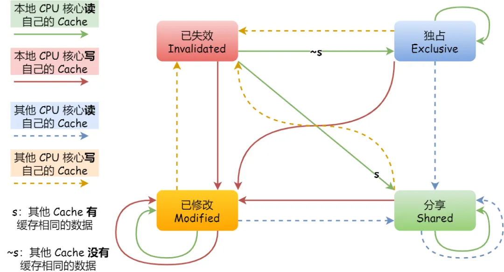
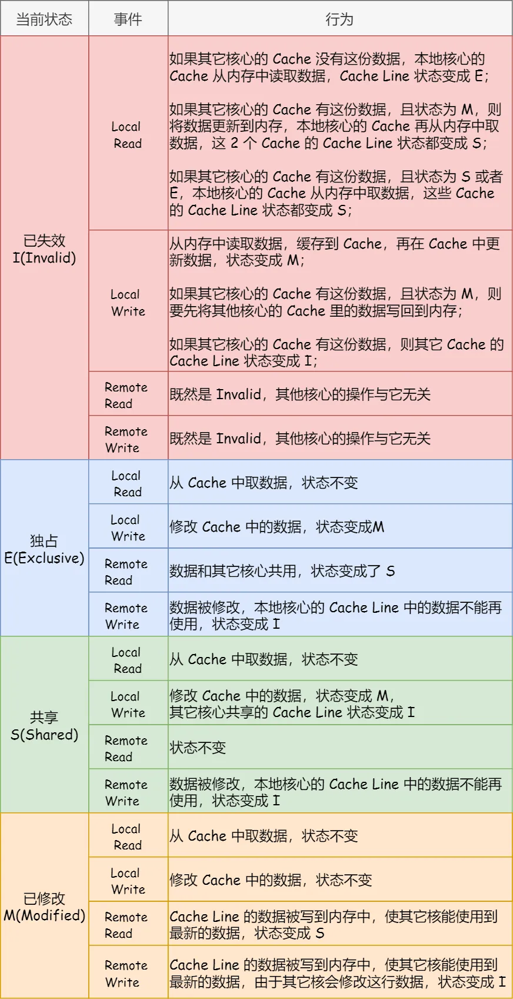

## 写直达

把数据同时写入内存和 Cache 中，这种方法称为 **写直达**（_Write Through_）

在这个方法里，写入前会先判断数据是否已经在 CPU Cache 里面了：

1. 如果数据已经在 Cache 里面，先将数据更新到 Cache 里面，再写入到内存里面
2. 如果数据没有在 Cache 里面，就直接把数据更新到内存里面

写直达法很直观，也很简单，但是问题明显，无论数据在不在 Cache 里面，每次写操作都会写回到内存，这样写操作将会花费大量的时间，无疑性能会受到很大的影响

## 写回

**写回**（_Write Back_），当发生写操作时，新的数据仅仅被写入 Cache Block 里，只有当修改过的 Cache Block 被替换时才需要写到内存中，减少了数据写回内存的频率，这样便可以提高系统的性能

具体流程：

1. 如果当发生写操作时，数据已经在 CPU Cache 里的话，则把数据更新到 CPU Cache 里，同时标记 CPU Cache 里的这个 Cache Block 为脏（Dirty）的，这个脏的标记代表这个时候，我们 CPU Cache 里面的这个 Cache Block 的数据和内存是不一致的，这种情况是不用把数据写到内存里的
2. 如果当发生写操作时，数据所对应的 Cache Block 里存放的是别的内存地址的数据的话，就要检查这个 Cache Block 里的数据有没有被标记为脏的，如果是脏的话，我们就要把这个 Cache Block 里的数据写回到内存，然后再把当前要写入的数据，写入到这个 Cache Block 里，同时也把它标记为脏的；如果 Cache Block 里面的数据没有被标记为脏，则就直接将数据写入到这个 Cache Block 里，然后再把这个 Cache Block 标记为脏的就好了

## 缓存一致性问题

现在 CPU 都是多核的，由于 L1/L2 Cache 是多个核心各自独有的，那么会带来多核心的 **缓存一致性**（_Cache Coherence_） 的问题，如果不能保证缓存一致性的问题，就可能造成结果错误

解决方案：

1. 某个 CPU 核心里的 Cache 数据更新时，必须要传播到其他核心的 Cache，这个称为 **写传播**（_Wreite Propagation_）
2. 某个 CPU 核心里对数据的操作顺序，必须在其他核心看起来顺序是一样的，这个称为 **事务的串行化**（_Transaction Serialization_）
	1. CPU 核心对于 Cache 中数据的操作，需要同步给其他 CPU 核心
	2. 要引入 **锁** 的概念，如果两个 CPU 核心里有相同数据的 Cache，那么对于这个 Cache 数据的更新，只有拿到了 锁，才能进行对应的数据更新

### 总线嗅探

总线嗅探（Bus Snooping），当 A 号 CPU 核心修改了 L1 Cache 中 i 变量的值，通过总线把这个事件广播通知给其他所有的核心，然后每个 CPU 核心都会监听总线上的广播事件，并检查是否有相同的数据在自己的 L1 Cache 里面，如果 B 号 CPU 核心的 L1 Cache 中有该数据，那么也需要把该数据更新到自己的 L1 Cache

但是 CPU 需要每时每刻监听总线上的一切活动，但是不管别的核心的 Cache 是否缓存相同的数据，都需要发出一个广播事件，这无疑会加重总线的负载

另外，总线嗅探只是保证了某个 CPU 核心的 Cache 更新数据这个事件能被其他 CPU 核心知道，但是并不能保证事务串行化

### MESI 协议

1. **Modified**，已修改
2. **Exclusive**，独占
3. **Shared**，共享
4. **Invalidated**，已失效

**已修改** 状态就是前面提到的脏标记，代表该 Cache Block 上的数据已经被更新过，但是还没有写到内存里。而 **已失效** 状态，表示的是这个 Cache Block 里的数据已经失效了，不可以读取该状态的数据

**独占** 和 **共享** 状态都代表 Cache Block 里的数据是干净的，也就是说，这个时候 Cache Block 里的数据和内存里面的数据是一致性的

**独占** 和 **共享** 的差别在于，独占状态的时候，数据只存储在一个 CPU 核心的 Cache 里，而其他 CPU 核心的 Cache 没有该数据。这个时候，如果要向独占的 Cache 写数据，就可以直接自由地写入，而不需要通知其他 CPU 核心，因为只有你这有这个数据，就不存在缓存一致性的问题了，于是就可以随便操作该数据

另外，在 **独占** 状态下的数据，如果有其他核心从内存读取了相同的数据到各自的 Cache ，那么这个时候，独占状态下的数据就会变成共享状态

那么，**共享** 状态代表着相同的数据在多个 CPU 核心的 Cache 里都有，所以当我们要更新 Cache 里面的数据的时候，不能直接修改，而是要先向所有的其他 CPU 核心广播一个请求，要求先把其他核心的 Cache 中对应的 Cache Line 标记为「无效」状态，然后再更新当前 Cache 里面的数据

