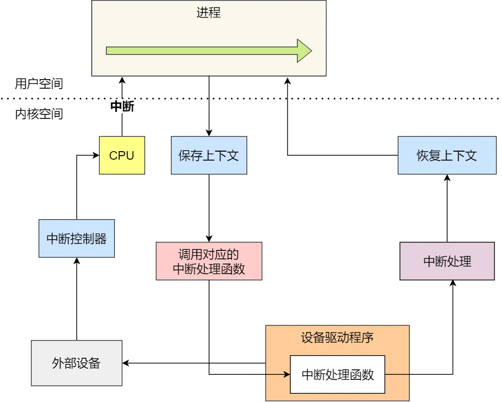

虽然设备控制器屏蔽了设备的众多细节，但每种设备的控制器的寄存器、缓冲区等使用模式都是不同的，所以为了屏蔽 [设备控制器](设备控制器) 的差异，引入了**设备驱动程序**

设备控制器不属于操作系统范畴，它是属于硬件，而设备驱动程序属于操作系统的一部分，操作系统的内核代码可以像本地调用代码一样使用设备驱动程序的接口，而设备驱动程序是面向设备控制器的代码，它发出操控设备控制器的指令后，才可以操作设备控制器

不同的设备控制器虽然功能不同，但是 **设备驱动程序会提供统一的接口给操作系统**，这样不同的设备驱动程序，就可以以相同的方式接入操作系统

设备完成了事情，则会发送中断来通知操作系统。那操作系统就需要有一个地方来处理这个中断，这个地方也就是在设备驱动程序里，它会及时响应控制器发来的中断请求，并根据这个中断的类型调用响应的 **中断处理程序** 进行处理

通常，设备驱动程序初始化的时候，要先注册一个该设备的中断处理函数

中断处理程序的处理流程：

1. 在 I/O 时，设备控制器如果已经准备好数据，则会通过中断控制器向 CPU 发送中断请求
2. 保护被中断进程的 CPU 上下文
3. 转入相应的设备中断处理函数
4. 进行中断处理
5. 恢复被中断进程的上下文