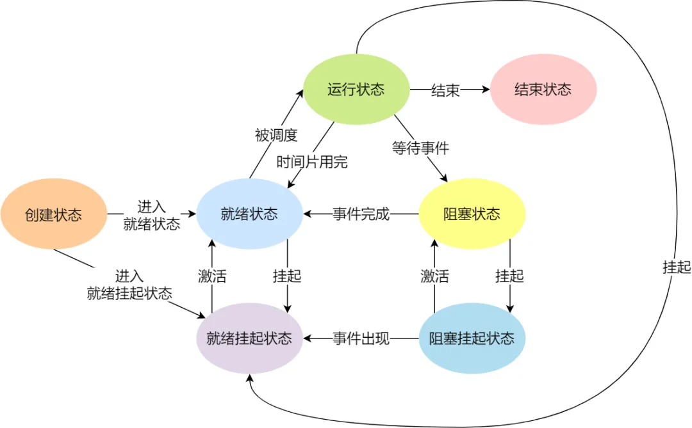

## 进程

### 进程的基本状态

1. 创建状态（new）
2. 就绪状态（ready）
3. 运行状态（running）
4. 阻塞状态（blocked）
5. 结束状态（exit）

另外，还有一种 **挂起状态**，表示进程没有占用物理内存空间。由于虚拟[[内存管理]]原因，进程所使用的空间可能没有被映射到物理内存，而是在硬盘上，这时进程就会出现挂起状态，另外调用 sleep 也会被挂起

#### 两种挂起状态

1. **阻塞挂起状态**：进程在硬盘并等待某个事件的出现
2. **就绪挂起状态**：进程在硬盘，但只要进入内存，立刻运行

### 进程的状态变迁

1. NULL -> 创建状态：一个新进程被创建时的第一个状态
2. 创建状态 -> 就绪状态：当进程被创建完成并初始化后，一切就绪准备运行时，变为就绪状态
3. 就绪状态 -> 运行状态：处于就绪状态的进程被操作系统的进程调度器选中后，就分配给 CPU 正式运行该进程
4. 运行状态 -> 结束状态：当进程已经运行完成或出错时，会被操作系统作结束状态处理
5. 运行状态 -> 就绪状态：处于运行状态的进程在运行过程中，由于分配给它的运行时间片用完，操作系统会把该进程变为就绪状态，接着从就绪队列选中另一个进程运行
6. 运行状态 -> 阻塞状态：当进程请求某个事件且必须等待时，例如请求 I/O 事件
7. 阻塞状态 -> 就绪状态：当进程要等待的事件完成时，从阻塞状态变为就绪状态

### 进程的控制结构

在操作系统中，使用 **进程控制块**（process control block，PCB）数据结构来描述进程，PCB 是进程存在的唯一标识

#### PCB 具体包含什么信息

##### 进程描述信息

1. **进程描述符**：标识各个进程，每个进程都有一个并且唯一的标识符
2. **用户标识符**：进程归属的用户，用户标识符主要为共享和保护服务

##### 进程控制和管理信息

1. **进程当前状态**：如 new、ready、running、waiting 或 blocked 等
2. **进程优先级**：进程抢占 CPU 时的优先级

##### 资源分配清单

有关内存地址空间或虚拟地址空间的信息，所打开文件的列表和所使用的 I/O 设备信息

##### CPU 相关信息

CPU 中各个寄存器的值，当进程被切换时，CPU 的状态信息都会被保存在相应的 PCB 中，以便进程重新执行时，能从断点处继续执行

#### 每个 PCB 如何组织

通常是通过 **链表** 的方式进行组织，把具有相同状态的进程链在一起，组成各种队列

### 进程的控制

#### 创建进程

操作系统允许一个进程创建另一个进程，并且允许子进程继承父进程所拥有的资源，当子进程被终止时，其在父进程处继承的资源应当还给父进程。同时，终止父进程时也会终止其所有的子进程

创建进程的过程如下：

1. 为新进程分配一个唯一的进程标识号，并申请一个空白的 PCB，PCB 是有限的，若申请失败则创建失败
2. 为进程分配资源，如果资源不足，进程就会进入等待状态，以等待资源
3. 初始化 PCB
4. 如果进程的调度队列能够接纳新进程，就将进程插入到就绪队列，等待被调度运行

#### 终止进程

可以有 3 种终止方式：正常结束、异常结束以及外界干预（kill 信号）

终止进程的过程如下：

1. 查找需要终止的进程的 PCB
2. 如果处于执行状态，则立刻终止该进程的执行，然后将 CPU 资源分配给其他进程
3. 如果还有子进程，则应将其所有子进程终止
4. 将该进程所拥有的全部资源都归还给父进程或操作系统
5. 将其从 PCB 所在队列中删除

#### 阻塞进程

当进程需要等待某一事件完成时，可以调用阻塞语句把自己阻塞等待，而一旦被阻塞等待，只能由另一个进程唤醒

阻塞进程的过程如下：

1. 找到将要被阻塞进程标识号对应的 PCB
2. 如果该进程为运行状态，则保护其现场，将其状态转为阻塞状态，停止运行
3. 将该 PCB 插入到阻塞队列中

#### 唤醒进程

进程由运行转变为阻塞状态是由于进程必须等待某一事件的完成，所以处于阻塞状态的进程不可能唤醒自己

如果某进程正在等待 I/O 事件，需由别的进程发消息给它，则只有当该进程所期待的事件出现时，才由发现者进程用唤醒语句唤醒它

唤醒进程的过程如下：

1. 在该事件的阻塞队列中找到相应进程的 PCB
2. 将其从阻塞队列中移出，并置为就绪状态
3. 把该 PCB 插入到就绪队列中，等待调度程序调度

### CPU 上下文切换

任务是交给 CPU 运行的，那么在每个任务运行前，CPU 需要知道任务从哪里加载，又从哪里开始运行。所以操作系统需要事先帮 CPU 设置好 **CPU 寄存器** 和 **程序计数器**。所以说，CPU 寄存器和程序计数器是 CPU 在运行任何任务前，所必须依赖的环境，这些环境就称为 **CPU 上下文**

CPU 上下文切换就是先把前一个任务的 CPU 上下文保存起来，然后加载新任务的上下文，最后再跳转到程序计数器所指的新位置，运行新任务

CPU 上下文切换有：[进程上下文切换](#进程上下文切换)、[线程上下文切换](#线程上下文切换)和中断上下文切换

### 进程上下文切换

各个进程之间是共享 CPU 资源的，在不同的时候进程之间需要切换，让不同的进程可以在 CPU 执行，那么这个从一个进程切换到另一个进程运行的过程，称为进程的上下文切换

进程是由内核管理和调度的，所以进程的切换只能发生在内核态。进程的上下文切换不仅包含了虚拟内存、栈、全局变量等用户空间的资源，还包含了内核堆栈、寄存器等内核空间的资源

#### 发生进程上下文切换的场景

1. 为了保证所有进程可以得到公平调度，CPU 时间被划分为一段段的时间片，这些时间片再被轮流分配给各个进程。这样，当某个进程的时间片耗尽了，就会被系统挂起，切换到其他正在等待 CPU 的进程运行
2. 进程在系统资源不足时，要等到资源满足后才可以运行，这个时候进程也会被挂起，并由系统调度其他进程运行
3. 当进程通过 sleep 函数将自己主动挂起时，自然也会重新调度
4. 当有优先级更高的进程运行时，为了保证高优先级进程的运行，当前进程会被挂起，由高优先级进程来运行
5. 发生硬件中断时，CPU 上的进程会被中断挂起，转而执行内核中的中断服务程序

## 线程

线程是进程当中的一条执行流程。同一进程内的多个线程之间可以共享代码段、数据段、打开的文件等资源，但每个线程都有独立一套的寄存器和栈，这样可以确保线程的控制流是相对独立的

### 线程的优点

1. 一个进程中可以同时存在多个线程
2. 各个线程之间可以并发执行
3. 各个线程之间可以共享地址空间和文件等资源
### 线程的缺点

当进程中的一个线程崩溃时，会导致其所属进程的所有线程崩溃

### 线程与进程的比较

1. 进程是资源（包括内存、打开的文件等）分配的单位，线程是 CPU 调度的单位
2. 进程拥有一个完整的资源平台，而线程只独享必不可少的资源，如寄存器和栈
3. 线程同样具有就绪、阻塞、执行三种基本状态，同样具有状态之间的转换关系
4. 线程能减少并发执行的时间和空间开销
	1. 线程的创建时间比进程快，因为进程在创建的过程中，还需要资源管理信息，比如内存管理信息、文件管理信息，而线程在创建的过程中，不会涉及这些资源管理信息，而是共享它们
	2. 线程的终止时间比进程快，因为线程释放的资源相比进程少很多
	3. 同一进程内的线程切换比进程切换快，因为线程具有相同的地址空间（虚拟内存共享），这意味着同一个进程的线程都具有同一个页表，那么再切换的时候不需要切换页表。而对于进程之间的切换，切换的时候需要切换页表，而页表的切换过程开销是比较大的
	4. 由于同一进程的各线程间共享内存和文件资源，那么在线程之间数据传递的时候，就不需要经过内核了，这就使得线程之间的数据交换效率更高了

### 线程上下文切换

1. 当两个线程不属于同一进程，则切换的过程就跟[进程上下文切换](#进程上下文切换)一样
2. 当两个线程属于同一进程，因为虚拟内存是共享的，所以在切换时，虚拟内存这些资源就保持不动，只需要切换线程的私有数据、寄存器等不共享的数据

### 线程的实现

主要有三种线程的实现方式：

1. **[用户线程](#用户线程)**（User Thread）：在用户空间实现的线程，不是由内核管理的线程，是由用户态的线程库来完成线程的管理
2. **[内核线程](#内核线程)**（Kernel Thread）：在内核中实现的线程，由内核管理
3. **[轻量级线程](#轻量级线程)**（LightWeight Process，LWP）：在内核中来支持用户线程

#### 用户线程

**多对一** 的关系，多个用户线程对应同一个内核线程

用户线程是基于用户态的线程管理库来实现的，那么 **线程控制块**（Thread Control Block，TCB）也是在库里实现的，对于操作系统而言是看不到这个 TCB 的，只能看到整个进程的 PCB

所以，用户线程的整个线程管理和调度，操作系统是不直接参与的，而是由用户级线程库函数来完成线程的管理，包括线程的创建、终止、同步和调度等

##### 优点

1. 每个进程都需要有它私有的线程控制块（TCB）列表，用来跟踪记录它各个线程状态信息（PC、栈指针、寄存器），TCB 由用户级线程库来维护，可用于不支持线程技术的操作系统
2. 用户线程的切换也是由线程库函数来完成的，无需用户态与内核态的切换，所以速度特别快

##### 缺点

1. 由于操作系统不参与线程的调度，如果一个线程发起了系统调用而阻塞，那进程所包含的用户线程都不能执行了
2. 当一个线程开始运行后，除非它主动交出 CPU 的使用权，否则它所在的进程中的其他线程无法运行，因为用户态的线程无法打断当前运行中的线程，它没有这个特权，只有操作系统有，但是用户线程不是由操作系统管理的
3. 由于时间片分配给进程，故与其他进程比，在多线程执行时，每个线程得到的时间片较少，执行会比较慢

#### 内核线程

**一对一** 的关系，一个用户线程对应一个内核线程

内核线程是由操作系统管理的，线程对应的 TCB 自然是放在操作系统里的，这样线程的创建、终止和管理都是由操作系统负责

##### 优点

1. 在一个进程中，如果某个内核进程发起系统调用而被阻塞，并不会影响其他内核线程的运行
2. 时间片分配给线程，多线程的进程获得更多的 CPU 时间

##### 缺点

1. 在支持内核线程的操作系统中，由内核来维护进程和线程的上下文信息，如 PCB 和 TCB
2. 线程的创建、终止和切换都是通过系统调用的方式来进行，因此对于系统来说，系统开销比较大

#### 轻量级线程

**多对多** 的关系，多个用户线程对应多个内核线程

轻量级线程是由内核支持的用户线程，一个进程可有一个或多个 LWP，每个 LWP 是跟内核线程一对一映射的，LWP 只能由内核管理并像普通进程一样被调度，Linux 内核是支持 LWP 的典型例子

在大多数系统中，LWP 和普通进程的区别也在于它只有一个最小的执行上下文和调度程序所需的统计信息。在 LWP 之上也是可以使用用户线程的，那么 LWP 与用户线程的对应关系就有三种：

##### 1 : 1 模式

一个线程对应到一个 LWP 再对应到一个内核线程

1. **优点**：实现并行，当一个 LWP 阻塞，不会影响其他 LWP
2. **缺点**：每产生一个用户线程，就产生一个内核线程，创建线程的开销较大

##### N : 1 模式

多个用户线程对应一个 LWP 再对应一个内核线程，线程管理是在用户空间完成的，此模式中用户的线程对操作系统不可见

1. **优点**：用户线程要开几个都没问题，且上下文切换发生在用户空间，切换的效率较高
2. **缺点**：一个用户线程如果阻塞了，那么整个进程都会阻塞，另外在多核 CPU 中，是没办法充分利用 CPU 的

##### M : N 模式

提供了两级控制，多个用户线程对应到多个 LWP，LWP 再一一对应到内核线程

**优点**：综合了前两种的优点，大部分线程上下文切换发生在用户空间，且多个线程又可以充分利用多核 CPU 的资源

##### 组合模式

组合 1 : 1 和 N : 1 模式，可以针对不同的应用特点调节内核线程的数目来达到物理并行性和逻辑并行性的最佳方案

## 调度

**调度程序**（scheduler）：选择一个进程运行

### 调度时机

在进程的生命周期中，当进程从一个运行状态到另外一个状态变化的时候，就会触发一次调度

1. 从 **就绪态** -> **运行态**：当进程被创建时，会进入就绪队列，操作系统会从就绪队列选择一个进程运行
2. 从 **运行态** -> **阻塞态**：当进程发生 I/O 事件而阻塞时，操作系统必须选择另外一个进程运行
3. 从 **运行态** -> **结束态**：当进程退出结束后，操作系统得从就绪队列选择另外一个进程运行

因为，这些状态变化的时候，操作系统需要考虑是否要让新的进程给 CPU 运行，或者是否让当前进程从 CPU 退出换另一个进程运行

另外，如果硬件时钟提供某个频率的周期性中断，那么可以根据如何处理时钟中断，把调度算法分为两类：

1. **非抢占式调度**：挑选一个进程，然后让该进程运行直到被阻塞，或者直到该进程退出，才会调用另一个进程，也就是说不处理时钟中断
2. **抢占式调度**：挑选一个进程，然后让该进程只运行某段时间，如果在该时段结束时，该进程仍在运行，则会把它挂起，接着调度程序从就绪队列挑选另外一个进程。这种抢占式调度处理，需要在时间间隔的末端发生时钟中断，以便把 CPU 控制返回给调度程序进行调度，也就是 **时间片机制**

### 调度原则

1. **原则一**：如果运行的程序，发生了 I/O 事件的请求，那 CPU 使用率必然会很低，因为此时进程在阻塞等待硬盘的数据返回。这样的过程，势必会造成 CPU 突然的空闲。所以，为了提高 **CPU 利用率**，在这种发生 I/O 事件致使 CPU 空闲的情况下，调度程序需要从就绪队列中选择一个进程来运行
2. **原则二**：有的程序执行某个任务花费的时间会比较长，如果这个程序一直占用着 CPU，会造成系统吞吐量（CPU 在单位时间内完成的进程数量）的降低。所以，要提高 **系统吞吐量**，调度程序要权衡长任务和短任务进程的运行完成数量
3. **原则三**：从进程开始到结束的过程中，实际上是包含两个时间，分别是进程运行时间和进程等待时间，这两个时间总和就称为 **周转时间**。进程的周转时间越小越好，如果进程的等待时间很长而运行时间很短，那周转时间就很长，这不是我们所期望的，调度程序应该避免这种情况的发生
4. **原则四**：处于就绪队列的进程，也不能等太久，这个 **等待时间** 越短越好，这样可以使得进程更快地在 CPU 中执行。所以，就绪队列中进程的等待时间也是调度程序所需要考虑的原则
5. **原则五**：对于鼠标、键盘这种交互性比较强的应用，我们当然希望它的 **响应时间** 越快越好，否则就会影响用户体验。所以，对于交互性比较强的应用，响应时间也是调度程序需要考虑的原则

针对上面的五种调度原则，总结如下：

1. **CPU 利用率**：调度程序应确保 CPU 是始终匆忙的状态，这可提高 CPU 的利用率
2. **系统吞吐量**：吞吐量表示的是单位时间内 CPU 完成进程的数量，长作业的进程会占用较长的 CPU 资源，因此会降低吞吐量，相反，短作业的进程会提升系统吞吐量
3. **周转时间**：周转时间是进程运行和阻塞时间总和，一个进程的周转时间越小越好
4. **等待时间**：等待时间是进程处于就绪队列的时间，等待的时间越长，用户越不满意
5. **响应时间**：用户提交请求到系统第一次产生响应所花费的时间，在交互式系统中，响应时间是衡量调度算法好坏的主要标准

### 调度算法

不同的调度算法适用的场景也是不同的

#### 单核 CPU 系统

##### 先来先服务调度算法

最简单的一个调度算法，就是非抢占式的 **先来先服务**（First Come First Serverd，FCFS）算法。每次从就绪队列选择最先进入队列的进程，然后一直运行，直到进程退出或被阻塞，才会继续从队列中选择第一个进程接着运行

FCFS 对长作业有利，适用于 CPU 繁忙型作业的系统，而不适用于 I/O 繁忙型作业的系统

##### 最短作业优先调度算法

**最短作业优先**（Shortest Job First，SJF），会选择运行时间最短的进程来运行，有助于提高系统的吞吐量。对长作业不利，极端情况下会导致长作业长期不会被运行

##### 高响应比优先调度算法

**高响应比优先**（Highest Response Ratio Next，HRRN）主要是权衡了短作业和长作业。每次进行进程调度时，先计算 **响应比优先级**，然后把响应比优先级最高的进程投入运行，响应比优先级的计算公式：

$$优先权 = \frac{等待时间 + 要求服务时间}{要求服务时间}$$

从公式可以发现：

1. 如果两个进程的 **等待时间** 相同时，**要求服务时间** 越短，**响应比** 就越高，这样短作业的进程容易被选中运行
2. 如果两个进程的 **要求服务时间** 相同时，**等待时间** 越长，**响应比** 就越高，这样就兼顾到了长作业进程

##### 时间片轮转调度算法

最古老、最简单、最公平且使用最广的算法就是 **时间片轮转**（Round Robin，RR）调度算法。每个进程被分配一个时间段，称为 **时间片**（Quantum），即允许该进程在该时间段中运行

1. 如果时间片用完，进程还在运行，那么将会把该进程从 CPU 释放出来，并把 CPU 分配给另一个进程
2. 如果该进程在时间片结束前阻塞或结束，则 CPU 立即进行切换

另外，时间片的长度就是一个很关键的点：

1. 如果时间片设得太短会导致过多的 [进程上下文切换](#进程上下文切换)，降低了 CPU 效率
2. 如果设得太长又可能引起对短作业进程的响应时间变长

通常，时间片的长度设为 **20 ms ~ 50 ms**

##### 最高优先级调度算法

对于多用户计算机系统，它们希望调度是有优先级的，即希望调度程序能从就绪队列中选择最高优先级的进程进行运行，这称为 **最高优先级**（Highest Priority First，HPF）调度算法

###### 进程的优先级

1. **静态优先级**：创建进程的时候，就已经确定了优先级，然后整个运行时间优先级都不会变化
2. **动态优先级**：根据进程的动态变化调整优先级，比如如果进程运行时间增加，则降低其优先级，如果进程等待时间增加，则升高其优先级

###### 处理优先级高的方法

1. **非抢占式**：当就绪队列中出现优先级高的进程，运行完当前进程，再选择优先级高的进程
2. **抢占式**：当就绪队列中出现优先级高的进程，当前进程挂起，调度优先级高的进程运行

但是依旧有缺点，可能会导致低优先级的进程永远不会运行

##### 多级反馈队列调度算法

**多级反馈队列**（Multilevel Feedback Queue，MFQ）调度算法是 [时间片轮转算法](#时间片轮转调度算法) 和 [最高优先级算法](#最高优先级调度算法) 的综合和发展

顾名思义：

1. **多级** 表示有多个队列，每个队列优先级从高到低，同时优先级越高时间片越短
2. **反馈** 表示如果有新的进程加入优先级高的队列时，立刻停止当前正在运行的进程，转而去运行优先级高的队列

如何工作：

1. 设置了多个队列，赋予每个队列不同的优先级，每个队列优先级从高到低，同时优先级越高时间片越短
2. 新的进程会被放入到第一级队列的末尾，按 [先来先服务](#先来先服务调度算法) 的原则排队等待被调度，如果在第一级队列规定的时间片没运行完成，则将其转入到第二级队列的末尾，以此类推，直至完成
3. 当较高优先级的队列为空，才调度较低优先级的队列中的进程运行。如果进程运行时，有新进程进入较高优先级的队列，则停止当前运行的进程并将其移入原队列末尾，接着让较高优先级的进程运行

可以发现，对于短作业可能可以在第一级队列很快被处理完。对于长作业，如果在第一级队列处理不完，可以移入下次队列等待被执行，虽然等待的时间变长了，但是运行时间也会更长了。所以该算法很好地兼顾了长短作业，同时有较好的响应时间