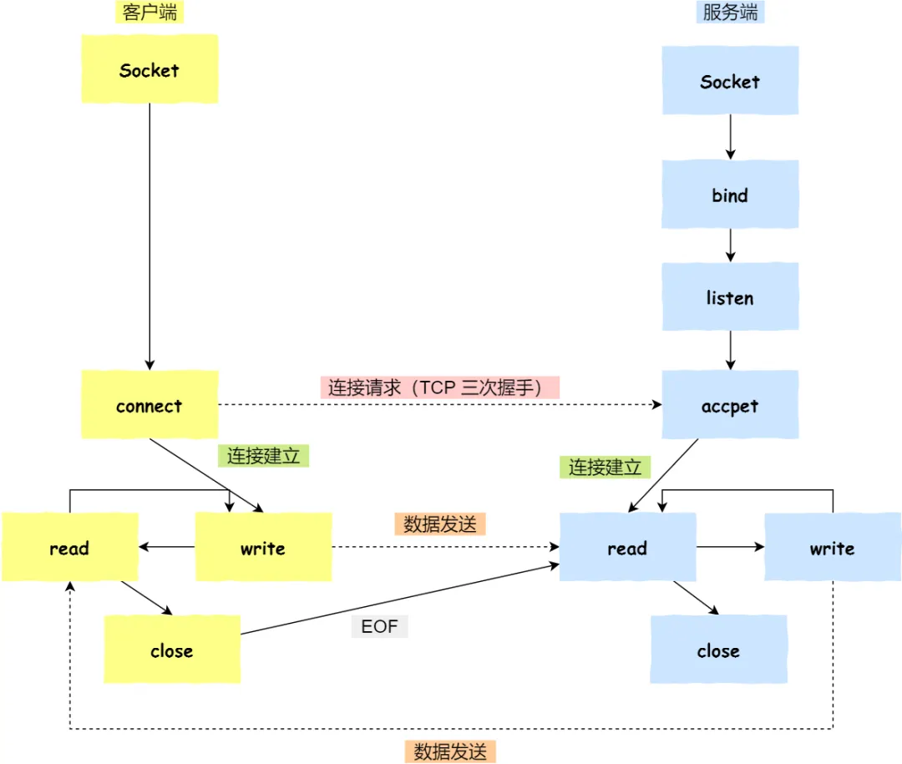
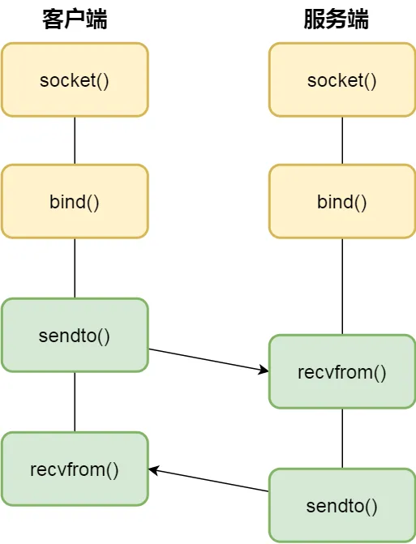

## 管道

```shell
$ ps auxf | grep mysql
```

上面命令行里的 **|** 竖线就是一个 **管道**，它的功能是将前一个命令（ps anxf）的输出，作为后一个命令（grep mysql）的输入，从这功能描述，可以看出，管道传输数据是 **单向** 的，如果想相互通信，需要创建两个管道。同时，上面这种管道是没有名字的，所以 **|** 表示的管道称为 **匿名管道**，用完了就销毁了。

管道还有另一个类型是 **命名管道**，也被叫做 **FIFO**，因为数据是先进先出的传输方式，在使用命名管道前，需要先通过 **mkfifo** 命令创建，并指定管道名字：

```shell
$ mkfifo myPipe
```

使用 ls 查看 myPipe，这个文件的类型是 p，也就是 pipe（管道）

```shell
$ ls -l
prw-r--r--. 1 root    root         0 Jul 17 02:45 myPipe
```

往 myPipe 写入数据

```shell
$ echo "hello" > myPipe
// 在这里停住了
```

因为管道内的内容没有被读取，只有管道内的数据被读完后，命令才可以正常退出

```shell
$ cat < myPipe
hello
```

管道的这种通信方式效率低，不适合进程间频繁地交换数据

### 管道如何创建

匿名管道的创建，需要通过下面这个系统调用：

```C
int pipe(int fd[2])
```

这里表示创建一个匿名管道，并返回两个描述符，一个是管道的读取端描述符 **fd\[0\]**，另一个是管道的写入端描述符 **fd\[1\]**。注意，这个匿名管道是特殊的文件，只存在于内存，不存在于文件系统

## 消息队列

消息队列是保存在内核中的消息链表，在发送数据时，会分成一个一个独立的数据单元，也就是消息体，消息体是用户自定义的数据类型，消息的发送方和接收方要约定好消息体的数据类型，所以每个消息体都是固定大小的存储块，不像 [管道](#管道) 是无格式的字节流数据，如果进程从消息队列中读取了消息体，内核就会把这个消息体删除

消息队列生命周期随内核，如果没有释放消息队列或没有关闭操作系统，消息队列会一直存在

消息队列通信不足的点：

1. 通信不及时
2. 附件有大小限制

消息队列不适合比较大数据的传输，因为在内核中每个消息体都有一个最大长度的限制，同时所有队列所包含的全部消息体的总长度也有上限。在 Linux 内核中，会有两个宏定义 **MSGMAX** 和 **MSGMNB**，以字节为单位，分别定义了一条消息的最大长度和一个队列的最大长度

消息队列通信过程中，存在用户态和内核态之间的数据拷贝开销，因为进程写入数据到内核中的消息队列时，会发生从用户态拷贝数据到内核态的过程，同理另一进程读取内核中的消息数据时，会发生从内核态拷贝数据到用户态的过程

## 共享内存

共享内存的机制，就是拿出一块虚拟地址空间来，映射到相同的物理内存中。这样这个进程写入的东西，另一个进程立马就能看到了，不需要拷贝，大大提高了进程间通信的速度

### 信号量

用了共享内存通信方式，带来新的问题，那就是如果多个进程同时修改同一个共享内存，很有可能造成冲突。为了防止多进程竞争共享资源，而造成数据错乱，所以需要保护机制—— [信号量](互斥与同步#信号量)

## 信号

使用 **kill -l** 查看所有信号

```shell
$ kill -l
1) SIGHUP        2) SIGINT       3) SIGQUIT      4) SIGILL       5) SIGTRAP
2) SIGABRT       7) SIGBUS       8) SIGFPE       9) SIGKILL     10) SIGUSR1
3) SIGSEGV      12) SIGUSR2     13) SIGPIPE     14) SIGALRM     15) SIGTERM
4) SIGSTKFLT    17) SIGCHLD     18) SIGCONT     19) SIGSTOP     20) SIGTSTP
5) SIGTTIN      22) SIGTTOU     23) SIGURG      24) SIGXCPU     25) SIGXFSZ
6) SIGVTALRM    27) SIGPROF     28) SIGWINCH    29) SIGIO       30) SIGPWR
7) SIGSYS       34) SIGRTMIN    35) SIGRTMIN+1  36) SIGRTMIN+2  37) SIGRTMIN+3
8) SIGRTMIN+4   39) SIGRTMIN+5  40) SIGRTMIN+6  41) SIGRTMIN+7  42) SIGRTMIN+8
9) SIGRTMIN+9   44) SIGRTMIN+10 45) SIGRTMIN+11 46) SIGRTMIN+12 47) SIGRTMIN+13
10) SIGRTMIN+14 49) SIGRTMIN+15 50) SIGRTMAX-14 51) SIGRTMAX-13 52) SIGRTMAX-12
11) SIGRTMAX-11 54) SIGRTMAX-10 55) SIGRTMAX-9  56) SIGRTMAX-8  57) SIGRTMAX-7
12) SIGRTMAX-6  59) SIGRTMAX-5  60) SIGRTMAX-4  61) SIGRTMAX-3  62) SIGRTMAX-2
13) SIGRTMAX-1  64) SIGRTMAX
```

1. Ctrl+C 产生 **SIGINT** 信号，表示终止该进程
2. Ctrl+Z 产生 **SIGTSTP** 信号，表示停止该进程，但未结束
3. kill -9 1050，表示给 PID 为 1050 的进程发送 **SIGKILL** 信号，用于立即结束该进程

信号是进程间通信机制中 **唯一** 的 **异步** 通信机制，用户进程对信号的处理方式如下：

1. **执行默认操作**：Linux 对每种信号都规定了默认操作，例如，上面列表中的 SIGTERM 信号，就是终止进程的意思。Core 的意思是 Core Dump，也即终止进程后，通过 Core Dump 将当前进程的运行状态保存在文件里面，方便程序员事后进行分析问题在哪里
2. **捕捉信号**：可以为信号定义一个信号处理函数。当信号发生时，就执行相应的信号处理函数
3. **忽略信号**：当我们不希望处理某些信号的时候，就可以忽略该信号，不做任何处理。有两个信号是应用进程无法捕捉和忽略的，即 **SIGKILL** 和 **SEGSTOP**，它们用于在任何时候中断或结束某一进程

## Socket

跨网络与不同主机上的进程之间通信，就需要 Socket 了。同时 Socket 也可以在同主机上的进程间通信

创建 socket 的系统调用：

```C
int socket(int domain, int type, int protocol)
```

1. domain 参数用于指定协议族，比如 **AF_INET** 用于 **IPV4**、**AF_INET6** 用于 **IPV6**、**AF_LOCAL/AF_UNIX** 用于本机
2. type 参数用来指定通信特性，比如 **SOCK_STREAM** 表示字节流，对应 **TCP**、**SOCK_DGRAM** 表示数据报，对应 **UDP**、**SOCK_RAW** 表示原始套接字
3. protocol 参数原本用于指定通信协议，但现在基本废弃，因为协议已通过前两个参数制定完成，目前该参数一般置为 0

根据创建 socket 类型的不同，通信的方式也不同：

1. **实现 TCP 字节流通信**：socket 类型是 AF_INET 和 SOCK_STREAM
2. **实现 UDP 数据报通信**：socket 类型是 AF_INET 和 SOCK_DGRAM
3. **实现本地进程间通信**：**本地字节流 socket** 类型是 AF_LOCAL 和 SOCK_STREAM，**本地数据包 socket** 类型是 AF_LOCAL 和 SOCK_DGRAM。另外，AF_UNIX 和 AF_LOCAL 是等价的

### 针对 TCP 协议通信的 socket 编程模型



1. 服务端和客户端初始化 socket，得到文件描述符
2. 服务端调用 bind，绑定 IP 地址和端口
3. 服务端调用 listen，进行监听
4. 服务端调用 accept，等待客户端连接
5. 客户端调用 connect，向服务端的地址和端口发起连接请求
6. 服务端 accept 返回用于传输的 socket 的文件描述符
7. 客户端调用 write 写入数据；服务端调用 read 读取数据
8. 客户端断开连接时，会调用 close，那么服务端的 read 读取数据的时候，就会读取到 EOF，待处理完数据后，服务端调用 close，表示连接关闭

需要注意的是，服务端调用 accept 时，连接成功了会返回一个已完成连接的 socket，后续用于传输数据。所以，监听的 socket 和真正用于传输数据的 socket，是 **两个** socket，一个叫作 **监听 socket**，一个叫作 **已完成连接 socket**

### 针对 UDP 协议通信的 socket 编程模型



每次通信时，调用 sendto 和 recvfrom，都需要传入目标主机 IP 地址和端口

### 针对本地进程间通信的 socket 编程模型

本地字节流 socket 和 本地数据报 socket 在 bind 的时候，不像 TCP 和 UDP 要绑定 IP 地址和端口，而是 **绑定一个本地文件**，这也就是它们之间的最大区别